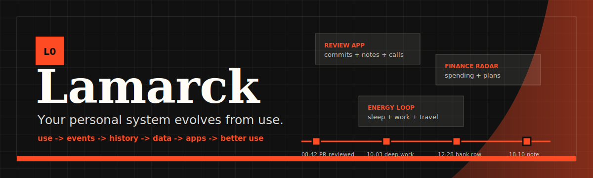
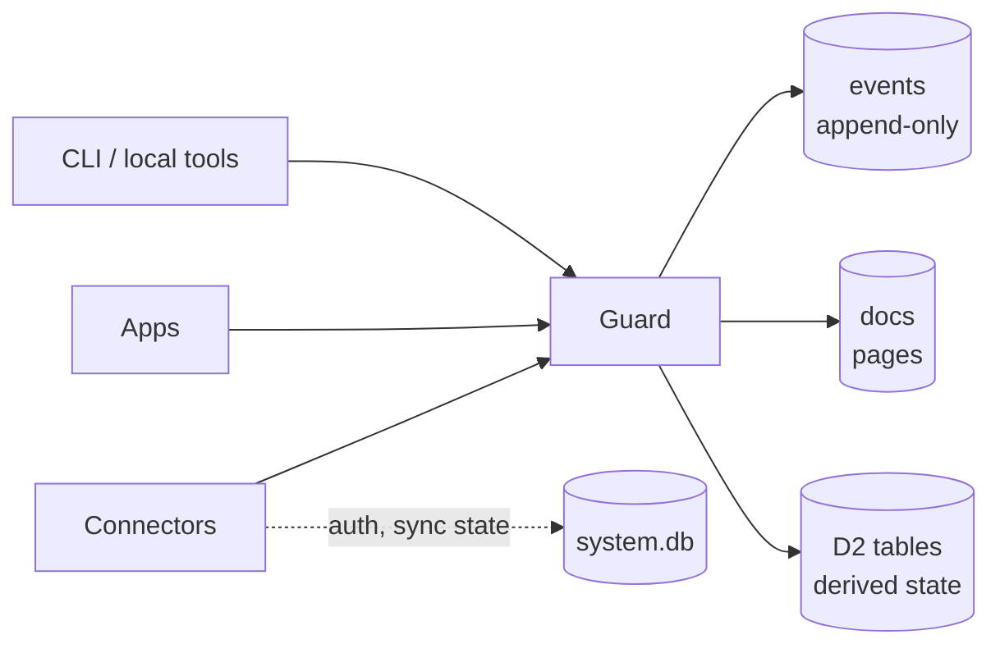

<p align="center">
  <br />
  <picture>
    
  </picture>
</p>

<h1 align="center">Lamarck</h1>

<p align="center">
  <strong>A local-first substrate for personal systems that evolve from use.</strong>
</p>

<p align="center">
  <a href="https://lamarck.ai"></a>
  
  
  
</p>

<p align="center">
  <a href="#quick-start">Quick start</a>
  ·
  <a href="#architecture">Architecture</a>
  ·
  <a href="#app-model">App model</a>
  ·
  <a href="#development">Development</a>
  ·
  <a href="design/README.md">Design docs</a>
</p>

---

**Lamarck** is a local-first personal state substrate: an append-only event log, derived data store, guarded write API, connector runtime, and sandboxed app runtime.

Not memory for an agent. Memory for the person.

Agent memory helps an assistant get better at the next task. Lamarck keeps the timeline for your own self-improving loop: goals, plans, actions, feedback, and the tools that evolve around them. The point is that your life becomes a self-improving system.

## Philosophy

People do not need one perfect productivity app. They need personal systems that can change as their life and work change.

Most software makes you migrate yourself from one interface to the next. Lamarck keeps the owned timeline underneath: goals, plans, actions, feedback, decisions, documents, app events, and external signals. Interfaces can be replaced. The history stays.

Long term: every tool you build should start from your existing history, not a blank prompt or empty database.

The design target is simple: keep an owned timeline of what happened, then let apps, connectors, automations, and AI-generated interfaces build on the same history instead of starting from an empty database every time.

> Rename note: this repository is moving from **Adiabatic OS** to **Lamarck**. Package names, workspace paths, environment variables, and CLI commands still use `adiabatic` while the product language moves over.

## Evolvability

Lamarck is designed so most of the system can change.

Memory indexing can change. Retrieval can change. Apps can be deleted, forked, regenerated, or replaced. The acting agent can change whenever a better model or workflow appears.

The stable part is the guarded event flow: the source of truth that runs through your life and work. Everything else is allowed to evolve around it.

## Core contracts

These are the parts the system is built to protect:

- **Events are append-only.** The raw trail is never edited in place.
- **Guard is the only durable write path.** Apps, connectors, AI, and local tools request writes; Guard applies them.
- **Source identity is injected by runtime.** Callers do not get to choose their own provenance.
- **Apps can read broadly but write narrowly.** Write access comes from `manifest.json` grants.
- **Data shapes are replaceable.** Docs and D2 tables can change, be regenerated, or be thrown away without deleting events.
- **Control-plane state is separate.** Connector auth, encrypted secrets, scheduler state, and sync checkpoints live in `system.db`, outside app-readable data.

## Quick start

Status: early local demo. The desktop shell and core runtime work, but the public install path is still being shaped.

Requirements:

- Node.js 22+
- npm
- Bun

```bash
git clone https://github.com/wenhsinghuang/adiabatic-os.git
cd adiabatic-os
npm install

npm --workspace @adiabatic/shell run electron:dev
```

On first launch, the Electron shell starts the Bun core runtime and creates a local workspace at `~/Adiabatic` if one does not already exist.

Useful commands:

```bash
# Run the desktop shell
npm --workspace @adiabatic/shell run electron:dev

# Run core tests
npm --workspace @adiabatic/core run test

# Run shell tests
npm --workspace @adiabatic/shell run test

# Build the shell
npm --workspace @adiabatic/shell run build
```

## Architecture

```text
Electron shell
  -> Bun core server
    -> Guard
      -> .adiabatic/data.db
      -> .adiabatic/system.db
```



| Part | What it does | Current implementation |
|---|---|---|
| **Core** | Local HTTP runtime, DB access, app loader, connector supervisor | `desktop/core/src/index.ts` |
| **Shell** | Electron + React desktop UI | `desktop/shell/` |
| **Guard** | Single durable write boundary | `desktop/core/src/guard.ts` |
| **Data DB** | User-visible state: events, docs, derived tables | `.adiabatic/data.db` |
| **System DB** | Control-plane state: connectors, auth, encrypted secrets | `.adiabatic/system.db` |
| **Template** | First-launch workspace skeleton | `desktop/template/` |

## Data model

Lamarck keeps raw history and current shape separate.

| Layer | Storage | Purpose |
|---|---|---|
| **Events** | `events` table in `data.db` | Append-only record of what happened. |
| **Docs** | `docs` table plus workspace pages | Human-editable working state. |
| **D2 tables** | runtime-created SQL tables | Derived/read-model state owned by app or schema lifecycle. |
| **Control plane** | `system.db` | Connector integrations, auth refs, encrypted secrets, scheduler state. |

Events cannot be updated or deleted. D2 tables can be changed, replaced, or re-derived.

## Write model

All persistent writes go through Guard.

Guard is responsible for:

- injecting source identity
- keeping events append-only
- enforcing app write permissions
- routing schema changes through promote/demote requests
- keeping control-plane state out of app-readable data

The important constraint:

```text
apps/connectors/AI/local tools do not mutate durable state directly
```

They request writes through the system API or core endpoints, and Guard decides what is allowed.

## App model

Apps are ordinary React apps inside the workspace.

```text
apps/<app-id>/
  manifest.json
  package.json
  index.tsx
```

`manifest.json` declares write grants:

```json
{
  "id": "my-app",
  "name": "My App",
  "permissions": {
    "write": ["my_table"]
  }
}
```

Apps read globally, but write only through declared grants:

```tsx
import * as React from "react";
import { system } from "@adiabatic/system";

export default function App() {
  const [rows, setRows] = React.useState<unknown[]>([]);

  async function refresh() {
    const result = await system.query("SELECT * FROM events ORDER BY started_at DESC LIMIT 20");
    setRows(result.rows);
  }

  return <button onClick={refresh}>Refresh</button>;
}
```

Available app API:

```ts
system.query(sql, params?)
system.write(sql, params?)
system.writeDoc(id, content, metadata?)
system.deleteDoc(id)
system.writeEvent(event)
```

## Connector model

Connectors are adapters that bring external signals into the event log.

The current runtime supports the important pieces but is not production-hard yet:

- connector manifests
- install/remove flow
- hash trust gate for bundled/custom packages
- scheduler state
- auth refs and encrypted credential storage
- runner isolation
- built-in connector catalog work in progress

Near-term connector targets:

- macOS accessibility/activity watcher
- local Claude/Codex transcript watcher
- Oura
- Telegram bot
- GitHub
- calendar
- browser extension

## Why this exists

Personal systems have high variance.

- Different people need different systems.
- The same person needs different systems at different stages.
- Interfaces change faster than the underlying history should.

Lamarck is the stable layer below those changing interfaces. A generated dashboard, review app, finance tracker, or workflow should be disposable. The event history, data, and permissions underneath should not be.

## Current capabilities

<table>
  <tr>
    <td><strong>Desktop shell</strong></td>
    <td>Pages, data views, apps, source editor, activity, and connector UI.</td>
  </tr>
  <tr>
    <td><strong>Core runtime</strong></td>
    <td>Bun HTTP server with Guard as the only durable write path.</td>
  </tr>
  <tr>
    <td><strong>Owned history</strong></td>
    <td>Append-only event log, MDX pages, and SQL-backed derived data.</td>
  </tr>
  <tr>
    <td><strong>App sandbox</strong></td>
    <td>React apps read system data and write only through declared grants.</td>
  </tr>
  <tr>
    <td><strong>Connector runtime</strong></td>
    <td>Install/remove, scheduler, auth plumbing, and connector catalog primitives.</td>
  </tr>
  <tr>
    <td><strong>Secrets</strong></td>
    <td>Electron <code>safeStorage</code> plus encrypted connector credentials.</td>
  </tr>
</table>

## Repository map

```text
lamarck/
├─ desktop/   Local desktop app source
│  ├─ core/      Bun HTTP runtime, Guard, DB, connector runtime, CLI
│  ├─ shell/     Electron + React desktop shell
│  └─ template/  First-launch workspace template, example apps, built-in connectors
├─ web/       Reserved for lamarck.ai / app.lamarck.ai / api.lamarck.ai services
├─ design/    Canonical design docs and archived design history
├─ reports/   Landing page and architecture report drafts
└─ e2e/       Playwright specs
```

Start with [design/README.md](design/README.md) for the current design index.

## Development

Run core tests:

```bash
npm --workspace @adiabatic/core run test
```

Run shell tests:

```bash
npm --workspace @adiabatic/shell run test
```

Build the shell:

```bash
npm --workspace @adiabatic/shell run build
```

Package a patch:

```bash
npm run package:patch
```

## Status

Pre-release. Current goal: a real OSS substrate demo that the author can use personally, friends can understand, and power users can run.

Near-term work:

- finish the first real connectors
- cold-start real personal loops on top of the substrate
- stabilize the app/job runtime
- expose a cleaner CLI for coding agents and local automation
- finish the Lamarck rename across package names, commands, and docs

## Name

Lamarck is a metaphor: systems can keep what they acquire from use.
